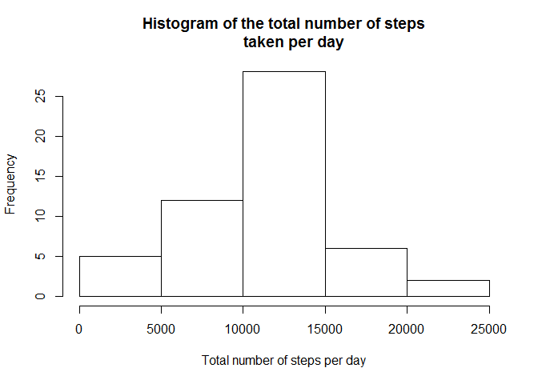
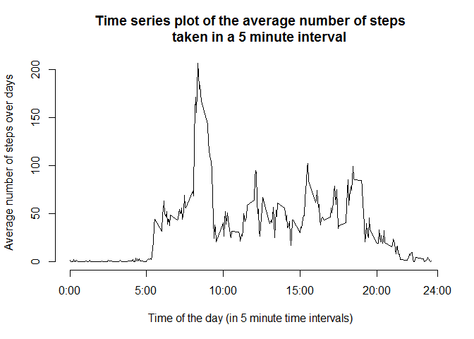
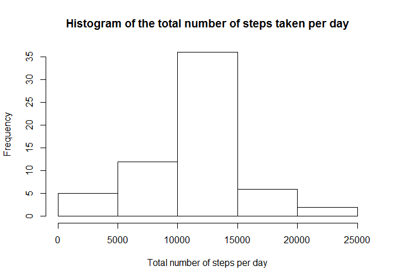
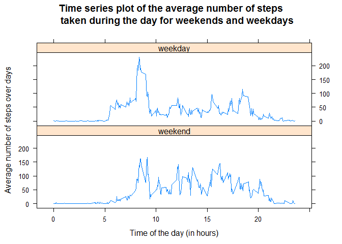

# Reproducible Research: Peer Assessment 1


## Loading and preprocessing the data
There are 17568 observations and we note that the variable 'steps' contains quite a few missing values. The variable interval has the time on an integer scale and we convert it to the usual representation HH:MM in a new variable.

```r
require(lattice)
```

```
## Loading required package: lattice
```

```r
activity=read.csv('activity.csv')
str(activity)
```

```
## 'data.frame':	17568 obs. of  3 variables:
##  $ steps   : int  NA NA NA NA NA NA NA NA NA NA ...
##  $ date    : Factor w/ 61 levels "2012-10-01","2012-10-02",..: 1 1 1 1 1 1 1 1 1 1 ...
##  $ interval: int  0 5 10 15 20 25 30 35 40 45 ...
```

```r
head(activity)
```

```
##   steps       date interval
## 1    NA 2012-10-01        0
## 2    NA 2012-10-01        5
## 3    NA 2012-10-01       10
## 4    NA 2012-10-01       15
## 5    NA 2012-10-01       20
## 6    NA 2012-10-01       25
```

```r
activity$interval=activity$interval/100
head(activity)
```

```
##   steps       date interval
## 1    NA 2012-10-01     0.00
## 2    NA 2012-10-01     0.05
## 3    NA 2012-10-01     0.10
## 4    NA 2012-10-01     0.15
## 5    NA 2012-10-01     0.20
## 6    NA 2012-10-01     0.25
```
## What is mean total number of steps taken per day?
We plot a histogram of the number of steps taken per day and from the plot the center of the distribution seems to be about 12000 steps/day. Looking at the summary statistics, the mean is 10770 steps/day and the median is 10760 steps/day. 

```r
activity_sub= activity[complete.cases(activity),]
hist(aggregate(activity_sub$steps, by = list(Day=activity_sub$date), FUN = sum)$x, xlab='Total number of steps per day', main='Histogram of the total number of steps
     taken per day')
```

 

```r
summary(aggregate(activity_sub$steps, by = list(Day=activity_sub$date), FUN = sum)$x)
```

```
##    Min. 1st Qu.  Median    Mean 3rd Qu.    Max. 
##      41    8841   10760   10770   13290   21190
```
## What is the average daily activity pattern?
We plot the average number of steps taken in a 5-minute interval below. As expected, hours where people are usually sleeping correspond to very low levels of activity (23:00-5:00). For the time interval with the highest average activity, we see that it corresponds to 8:35-8:40am where the average is about 206 steps.

```r
avg_steps_int=aggregate(activity_sub$steps, by = list(Interval=activity_sub$int), FUN = mean)
plot(avg_steps_int$Int, avg_steps_int$x, type='l', xlab='Time of the day (in 5 minute time intervals)', ylab='Average number of steps over days', main='Time series plot of the average number of steps
     taken in a 5 minute interval', axes=F)
axis(1, at = c(seq(0,24,by=5),24),labels = c("0:00","5:00","10:00","15:00","20:00","24:00"))
axis(2)
```

 

```r
avg_steps_int[which.max(avg_steps_int$x),]
```

```
##     Interval        x
## 104     8.35 206.1698
```

## Imputing missing values
There are 2304 observations with missing values in the data set, which corresponds to about 13% of the whole data. 

```r
sum(!complete.cases(activity))
```

```
## [1] 2304
```
For imputation, we will use the mean of the corresponding time interval as the imputed value since we see quite a bit of variation in the number of steps accross time intervals.

```r
missing=which(complete.cases(activity)==FALSE)
imputed_activity= activity
for( i in missing){
  imputed_activity$steps[i]= avg_steps_int$x[avg_steps_int$Int==imputed_activity$int[i]]
}
```

We plot the histogram of the number of steps taken per day based on the imputed data. Now we observe that the mean number of steps taken per day is equal to the median, at 10770 steps per day. The mean didn't change but the median increased to equal the mean. Thus, by using imputed data, there is a 'regression towards the mean' effect since the imputed values are located more towards the center of the data.

```r
hist(aggregate(imputed_activity$steps, by = list(Day=imputed_activity$date), FUN = sum)$x, xlab='Total number of steps per day', main='Histogram of the total number of steps taken per day')
```

 

```r
summary(aggregate(imputed_activity$steps, by = list(Day=imputed_activity$date), FUN = sum)$x)
```

```
##    Min. 1st Qu.  Median    Mean 3rd Qu.    Max. 
##      41    9819   10770   10770   12810   21190
```

## Are there differences in activity patterns between weekdays and weekends?

We first create a binary variable that specifies whether the observationw was recorded on a weekday versus a weekend.

```r
weekday_act=weekdays(as.Date(imputed_activity$date))
imputed_activity$ind_weekday=factor(rep("weekday",dim(imputed_activity)[1]), levels=c("weekday","weekend"))
imputed_activity$ind_weekday[(weekday_act=="Saturday")|(weekday_act=="Sunday")]="weekend"
```

As expected, from the plot below, we do see that on average there is more activity earlier in the day for weekdays as compared to weekends (people getting ready or commuting to work). We also notice that in the late morning and afternoon (after 10am) there seems to be more activity during weekends than weekdays on average. This is probably because on weekdays, people at that time are working so less likely to be walking around a lot gor most jobs.

```r
avg_steps_int=aggregate(imputed_activity$steps, by = list(Interval=imputed_activity$int, Week=imputed_activity$ind_weekday), FUN = mean)
xyplot(avg_steps_int$x~avg_steps_int$Int|avg_steps_int$Week, 
    type='l', xlab='Time of the day (in hours)', ylab='Average number of steps over days', main='Time series plot of the average number of steps
     taken during the day for weekends and weekdays',layout=c(1,2),index.cond=list(c(2,1)))
```

 

